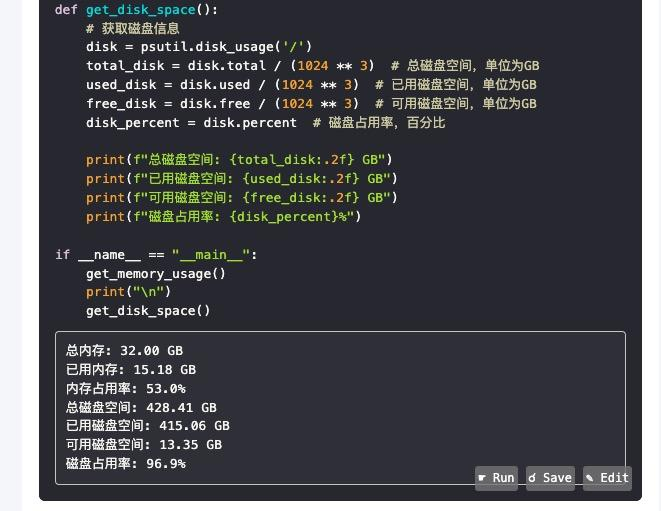

# Overview [中文](readme_CN.md)

A Chrome extension that allows for the direct execution and editing of code within the browser. Additionally, it offers the functionality to save code and edit it before running.

## Features

- **Run Code**: Execute code snippets in supported languages and display the results.

- **Save Code**: Send code snippets to a server for storage or further processing.

- **Edit Code**: Open a modal dialog within the browser to directly edit code snippets.

- **Multi-language Support**: Detect and support multiple programming languages, including Python, JavaScript, HTML, Bash, and PHP. You can customize your own backend to implement this.

- **Dynamic DOM Updates**: Automatically add functionality to dynamically inserted code blocks.

## List of Supported Websites

- Supports Gemini、Chatgpt、Github、Baidu、yiyan、Qwen、Phind、Kimi、chatglm.

## Installation Steps

1. Clone this repository:

   ```bash

   git clone https://github.com/zazaji/chrome-run-code.git

   ```

2. modify the `config.py` file in the backend directory to set TOKEN,and SAVE_PATH, etc.

3. Navigate to the backend directory and install the required dependencies by running `pip install -r requirements.txt`.

4. Then, run `sh run.sh` (Linux/Mac) or `run.cmd` (Windows) to run the server. Please consider the security implications.

5. Open Chrome and navigate to `chrome://extensions/`.

6. Enable Developer Mode by toggling it on in the top right corner.

7. Click on "Load unpacked" and select the directory where the extension is located.

8. Click on the extension, select option, configure the parameters, please refer to the configuration options below.

## Usage Instructions

1. Open the GPT webpage (such as ERNIE , Qwen, chatgpt, etc.) and ask GPT to write a piece of code.

2. The extension will automatically add "run", "save", and "edit" buttons next to the code blocks.

3. Click "run" to execute the code. The results will be displayed below the code block.

4. Click "save" to send the code to the configured server.

5. Click "edit" to modify the code in a modal popup box, then accept the changes. The modified content is displayed on the page and can be run by clicking "run".

6. If you need GPT to write code that can be saved to the corresponding file name, you should add comments and file names at the first line of the code, or you can have GPT implement it according to instructions. The format can refer to:

```python

# src/test.py
print("hello world")
```

## Screenshots





## Configuration Options

- The server address can be configured using Chrome's storage API, with the default being `http://localhost:8000/runcode`. It needs to be consistent with the backend service's token.

- Configure the authentication token for secure communication with the server. It needs to be consistent with the backend service's token.

- islocal can be used to choose whether to use the local server or the public server, with the default being true.

## License

MIT License.
