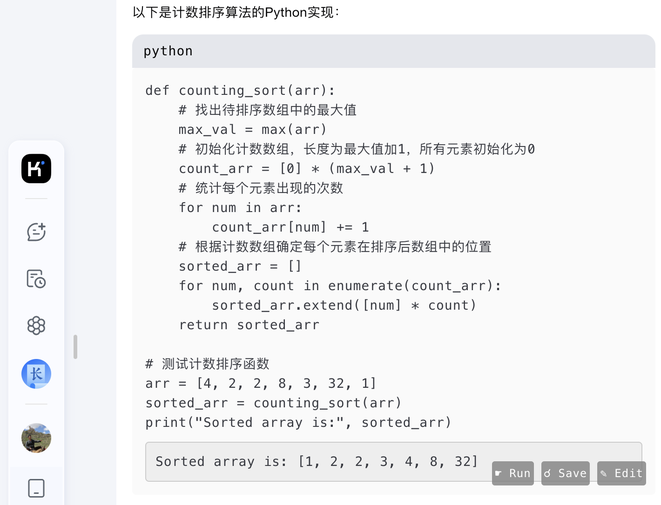

# Overview

A Chrome extension that allows for the direct execution and editing of code within the browser. Additionally, it offers the functionality to save code and edit it before running.

## Features

- **Run Code**: Execute code snippets in supported languages and display the results.

- **Save Code**: Send code snippets to a server for storage or further processing.

- **Edit Code**: Open a modal dialog within the browser to directly edit code snippets.

- **Multi-language Support**: Detect and support multiple programming languages, including Python, JavaScript, HTML, Bash, and PHP. You can customize your own backend to implement this.

- **Dynamic DOM Updates**: Automatically add functionality to dynamically inserted code blocks.

## Installation Steps

1. Clone this repository:

   ```bash

   git clone https://github.com/zazaji/chrome-run-code.git

   ```

2. Navigate to the backend directory and start the Python FastAPI service（sh run.sh）. For safety,suggest to be run in Docker.

3. Open Chrome and navigate to `chrome://extensions/`.

4. Enable Developer Mode by toggling it on in the top right corner.

5. Click on "Load unpacked" and select the directory where the extension is located.

## Usage Instructions

1. Navigate to a webpage that contains code snippets (such as documentation or tutorials).

2. The extension will automatically add "run", "save", and "edit" buttons next to the code blocks.

3. Click "run" to execute the code. The results will be displayed below the code block.

4. Click "save" to send the code to the configured server.

5. Click "edit" to modify the code in a modal popup box, then accept the changes. The modified content is displayed on the page and can be run by clicking "run".

## Screenshots





## Configuration Options

- The server address can be configured using Chrome's storage API, with the default being `http://localhost:8000/runcode`. It needs to be consistent with the backend service's token.

- Configure the authentication token for secure communication with the server. It needs to be consistent with the backend service's token.

## License

This project is licensed under the MIT License.
