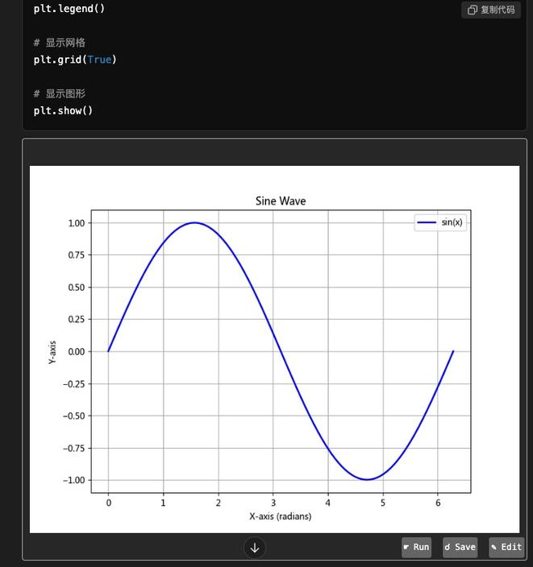

#

## 概述

这是一个chrome插件，可以在浏览器中直接执行和编辑代码。此外，还有编辑代码再运行的功能。

## 功能特点

- **运行代码**：执行支持语言的代码片段并显示结果。
- **保存代码**：将代码片段发送到服务器进行存储或进一步处理。
- **编辑代码**：在浏览器中打开模态框以直接编辑代码片段。
- **支持多种开发语言**：检测并支持多种编程语言，包括 Python、JavaScript、HTML、Bash等，你可以定制自己的后端来实现。
- **动态更新**：自动为动态插入的代码块添加功能。

## 支持的网站列表

- 支持Gemini、Chatgpt、Baidu、Yiyan、Qwen、Phind、Kimi、Chatglm，也支持Github直接运行单个代码。 还有更多的没页面有一一测试。

## 安装步骤


1. 克隆此仓库或者下载本项目：
   ```bash
   git clone https://github.com/zazaji/chrome-run-code.git
   ```
2. 修改backend目录下的config.py文件，设置TOKEN，SAVE_PATH等参数。
3. 进入backend目录，通过pip install -r requirements.txt安装运行所需的依赖。
4. 然后运行sh run.sh（linux、mac）或者在命令行中运行run.cmd（windows），请自己考虑安全问题。
5. 打开 Chrome 并导航到 `chrome://extensions/`。
6. 通过在右上角切换“开发者模式”来启用开发者模式。
7. 点击“加载已解压的扩展程序”，选择插件所在的目录，也就是下载的chrome-run-code文件夹。
8. 点击扩展，选择option，配置参数，请参照下方的配置选项。

## 使用方法

1. 打开GPT页面（例如文心一言、通义千问、chatgpt等页面），让GPT写一段代码。
2. 插件会自动在代码块旁边添加“run”、“save”和“edit”按钮。
3. 点击“run”以执行代码，结果将显示在代码块下方。
4. 点击“save”以将代码发送到配置的服务器。
5. 点击“edit”以在模态弹出框中修改代码，然后接受更改，更改后的内容在页面上显示，并且可以点击run运行修改后的代码。
6. 如果你需要让GPT写代码能够保存到对应的文件名，应该在代码的第一行加上注释和文件名，也可以让GPT按照指令实现。格式可以参考：

```python
# src/test.py
print("hello world")
```

## 截图





## 配置选项

- 服务器地址可以使用 Chrome 的存储 API 进行配置，默认为 `http://localhost:8000/runcode`。需要与后端服务的token一致。
- 配置服务器进行安全通信的token。需要与后端服务的token一致，确保安全。
- islocal 可以选择是否使用本地服务器还是使用公网服务器，默认为 true。

## 许可证

MIT License.
